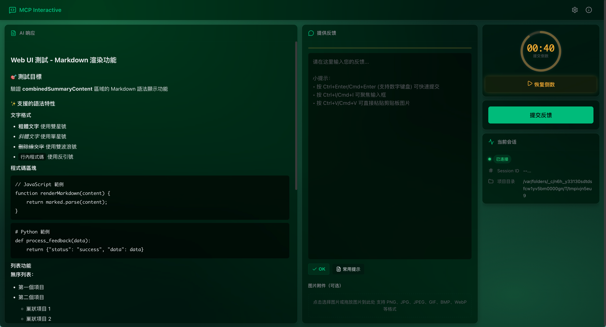

# mcp-interactive

**English** | [简体中文](README.md)

MCP server for collecting interactive user feedback during AI-assisted development. By guiding AI to confirm with users instead of guessing, it reduces unnecessary tool calls, cuts platform costs, and improves development efficiency.

<div align="center">
  
</div>

## Workflow

1. AI calls the `interactive_feedback` tool
2. Browser interface (Web UI) opens automatically
3. User provides feedback text, uploads screenshots, or picks a saved prompt
4. Feedback is delivered to AI in real-time via WebSocket
5. AI adjusts its behavior or completes the task based on feedback

## Installation

```bash
pip install uv
```

## Configuration

Add the following to your MCP configuration file:

```json
{
  "mcpServers": {
    "mcp-interactive": {
      "command": "uvx",
      "args": ["mcp-interactive@latest"],
      "timeout": 600,
      "autoApprove": ["interactive_feedback"]
    }
  }
}
```

Supported AI platforms: [Cursor](https://www.cursor.com) | [Cline](https://cline.bot) | [Windsurf](https://windsurf.com) | [Augment](https://www.augmentcode.com) | [Trae](https://www.trae.ai)

### Environment Variables

| Variable | Description | Default |
|----------|-------------|---------|
| `MCP_WEB_HOST` | Web UI bind address | `127.0.0.1` |
| `MCP_WEB_PORT` | Web UI port | `8765` |
| `MCP_LANGUAGE` | UI language (`zh-CN` / `en`) | Auto-detect |
| `MCP_DEBUG` | Debug mode | `false` |

For SSH remote development, set `MCP_WEB_HOST` to `0.0.0.0` to allow remote access, or use SSH port forwarding.

## Features

- **Prompt management** - CRUD for saved prompts with smart sorting
- **Auto-timed submit** - Configurable timer (1-86400s) with pause/resume
- **Image upload** - Drag & drop, paste from clipboard; PNG/JPG/GIF/BMP/WebP
- **Audio notifications** - Built-in sounds, custom uploads, volume control
- **Multi-language** - Simplified Chinese, English, instant switching
- **WebSocket real-time** - Status monitoring, auto-reconnect

## Development

```bash
git clone https://github.com/RealAlexandreAI/mcp-interactive.git
cd mcp-interactive
uv sync

# Test
make test          # Unit tests
make test-web      # Web UI test

# Code quality
make check         # Full check (lint + format + type)
```

## Credits

- Original project: [noopstudios/interactive-feedback-mcp](https://github.com/noopstudios/interactive-feedback-mcp) by [Fabio Ferreira](https://x.com/fabiomlferreira)
- Upstream fork: [Minidoracat/mcp-feedback-enhanced](https://github.com/Minidoracat/mcp-feedback-enhanced)

## License

MIT
